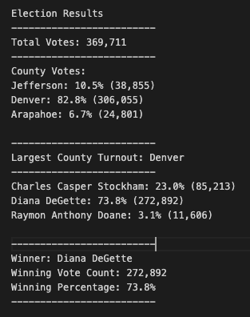

# **Overview of Election Audit**

The purpose of this election analysis audit is provide additional detailed data to the election commission. Specifically the commission would like to know the following:

   * Voter turnout for each county
   * Percentage of votes from each county out of the total count
   * The county with the highest turnout

# **Election Audit Results**
Using my code to analyze the results of this election, I discovered the following results from the election:

 * Total votes cast in this congressional election: 369,711
 * Breakdown of number of votes and percentage of total votes per county in precinct:
    * Jefferson: 38,855 votes, 10.5%
    * Denver: 306,055 votes, 82.8%
    * Arapahoe: 24,801 votes, 6.7%
* Denver was the county with largest votes cast in this election
* Breakdown of number of votes and percentage of total votes per canddiate:
    *  Charles Casper Stockham: 85,213 votes, 23%
    *  Diana DeGette: 272,892 votes, 73.8%
    *  Raymon Anthony Doane: 11,606 votes, 3.1%
* Election winner:
    * Winning candidate: Dianna DeGette
    * Vote count: 272,892 votes
    * Percentage of total votes: 73.8%
 
###### *Screenshot of Election Analysis Text Output File:*

# **Election Audit Summary**
The use of this code allowed an audit of the election results in detail in a relatively short period of time. This code can be used to audit and analyze other elections. The script currently allows us to find an overall winner for the election and obtain the total vote count and percentage share of the total votes cast. Additionally, we can use the existing script to find county level data around votes cast and percentage of total votes. This script can be modified and used for national elections where we want to know the overall winner of the election but also the precinct level data and winner at the precinct level. In order to obtian this data, the script would need to be modified so that the more detailed level of data (county data in this dataset) is counting and tracking candidate specific votes and not just the total votes cast per county. Another use of this script could be to audit ranked choice elections and winners of each round. Assuming our election results contain ranked choice outcomes, we can modify the existing script to include an additional for loop that would loop through the choice rankings for each vote cast. Additional edits would need to be made to how votes per candidate are added up and how the winner is determined.
